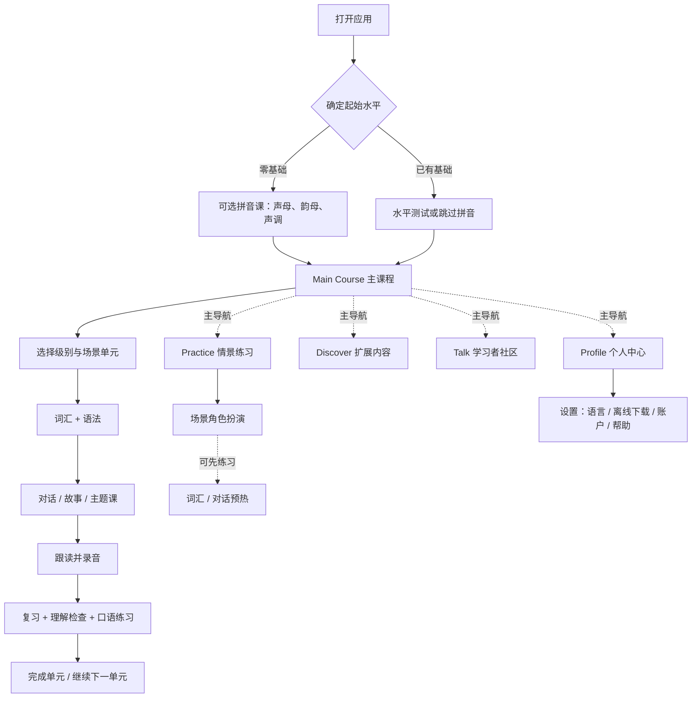

# 01｜界面结构与跳转

**调研日期：2026-09-25**
本篇描述公开资料能够确认的页面职责和跳转关系。它是对官方产品信息的结构化重建，不是对当前安装版本逐屏录屏后的界面规格。

## 1. 顶层信息架构

官方 FAQ 将产品分成 Main Course 及三个并列内容区；FAQ 也确认 Profile 位于底部导航栏。由这些说明可还原出以下顶层导航：

| 区域 | 页面职责 | 公开资料支持的内容 |
|---|---|---|
| Main Course 主课程 | 按级别/单元推进的核心课程 | 8 个级别，每级 24 个场景单元；一单元围绕一个实用场景组织。 |
| Practice 练习 | 真实情景口语演练 | 有场景角色扮演；近期更新说明角色扮演是主入口，词汇和对话可作为演练前的准备活动。 |
| Discover 探索 | 非主线扩展内容 | 热门中文、地道表达、HSK 词汇；FAQ 还列有词汇、语法、对话、故事和练习内容。 |
| Talk 社区 | 学习者之间的交流 | 官方将其描述为 learner community；商店用户评论也提到 Talk rooms，但社区具体版式未在官方 FAQ 展开。 |
| Profile 个人中心 | 账户、偏好与工具设置 | FAQ 明确了底部 Profile 入口，并列出语言、离线下载、账户删除和联系客服等路径。 |

来源：[官方 FAQ](https://www.superchinese.com/faq.html)、[Apple App Store 版本记录](https://apps.apple.com/us/app/superchinese-learn-chinese/id1462500984)。

## 2. 页面跳转模型

下面的流程图把**官方明确写出的路径**与**为说明信息架构而重建的连接**放在一起。实线为官方资料直接描述的关系；虚线是合理的页面组织推断，不能当作已验证的逐屏跳转。

**如何读图：** 官方 FAQ 明确了拼音课在 Level 1 之前、可跳过、可用水平测试选级；也明确了单元内容顺序和五个页面职责。图中“选择级别与单元”“完成后继续下一单元”符合官网学习路径示例和顺序课程描述，但当前应用具体采用何种地图、列表或锁定状态，需要实机确认。

## 3. 主要页面的布局层级

### 3.1 主课程 / 学习路径

官网首页公开了移动端学习路径预览：级别构成连续的学习路径，并展示单课示例（L1-1「介绍自己」）及词汇、语法、对话、测验/复习、口语练习等内容。FAQ 进一步说明每级 24 个单元，单元以场景为中心。基于这些信息，课程入口至少需要同时表达：

1. 学习者目前处于哪个级别/单元；
2. 当前场景是什么；
3. 本单元由哪些学习活动组成；
4. 完成后如何接着学。

这是对信息层级的归纳，不代表已验证的实际卡片形状、页面滚动方向或锁课方式。官网首页列出 L1–L7 的可见标签，而 FAQ 说课程有 8 级；应以 FAQ 的完整主课程口径为准，网站预览中的标签不应被用来推断只有 7 级。

### 3.2 单课页面

官方课程示例和 FAQ 显示，单课的内容次序围绕一个场景展开：词汇/语法先行，之后进入对话、故事或主题内容，再做练习和复习。口语不是课末才出现：每课会要求学习者录制台词并立即获得发音分数，错误反馈可以细到具体汉字；单元末再做一轮场景口语练习。

这形成一种可预期的页面节奏：**先理解 → 看/听语境 → 模仿输出 → 检查掌握 → 场景表达**。官方还在 2026 年版本记录中提到分段练习后再录完整句，以及统一学习页界面设计；可以确认其持续整理学习交互，但公开文字没有给出具体控件坐标或颜色系统。

### 3.3 Practice 情景练习

App Store 版本记录对 Practice 改版的说明是：情景角色扮演被放到显眼的主要入口，词汇与对话可以作为活动前的准备练习。因此它和 Main Course 的区别是“直接练场景表达”，而不是重复一遍完整课程。CHAO 方案支持无脚本角色扮演、轮流对话和自然度解释；官方没有公开所有场景页的具体布局。

### 3.4 Discover、Talk 与 Profile

- **Discover**：作为独立内容区承接主线之外的学习，包括热门话题/表达、HSK 词汇、语法、对话、故事等。2026 年版本记录提到加入 3–8 分钟的生活主题短课。
- **Talk**：社区入口，公开说明只有“学习者社区”，具体功能（房间、帖子、匹配等）应避免仅凭评论中的单个例子当作稳定规格。
- **Profile**：是设置和账户操作的入口。官方给出的确定路径包括：Profile → 右上角设置 → Offline download；Profile → 设置 → Language；Profile → 设置 → Account → Delete account；联系客服路径也从 Profile 底部导航开始。

## 4. 横屏与跨设备

App Store 将应用标为支持 iPhone/iPad；2026 年版本记录提到优化 iPad 横屏界面、支持手机和平板同时登录并同步学习进度。可确认平板不是单纯放大的手机模式目标，但公开文字不足以还原两栏/三栏、导航栏位置或横屏下的具体响应式规则。

## 5. 视觉设计结论与待核实项

### 可确认的设计取向

- **路径明确**：通过级别、单元、水平测试与先修拼音降低学习者选择成本。
- **情境先于孤立知识点**：一个单元对应一个实用生活场景，词汇和语法依附于使用情境。
- **短时、单任务推进**：官方把单课描述为约 10 分钟；应用商店说约 10–15 分钟，符合移动端短学习节奏。
- **输出反馈显性化**：录音后立即反馈，错误定位到字符；练习入口强调真实情景口语。
- **主线与扩展分层**：课程、复习/练习、扩展内容、社区分在不同区域，避免把所有资源挤进同一条课程路径。

### 公开资料不能确定

本次未验证当前应用的具体配色、字体、按钮尺寸、卡片圆角、底部导航图标、学习地图形状、完成态动画，也未确认所有国家/帐号看到的标签和付费弹窗是否一致。Google Play 提供截图，App Store 有 iPhone/iPad 产品图；正式做逐屏视觉复刻或细节判断前应在目标设备实机核验，并注意 Review Center 正在分批开放。

## 6. 对 MandarinLearnApp 的界面参考

1. 保留单一、明确的“继续当前课程”主入口；水平测试和日词路径可以作为起点选择，而不是和课程动作争夺同一屏的视觉权重。
2. 将连续课程、独立复习/练习、扩展内容、个人设置分开，避免首页变成所有功能的入口集合。
3. 在单课中固定内容顺序和主要动作；口语/书写反馈应指回错音节或错笔画，让学习者知道下一步修正什么。
4. 给主线单元和单课显示场景、学习目标、进度与完成状态，但不要将“HSK 对应”呈现成官方考试认证。
5. 以上是信息架构层面的借鉴；不要复制 SuperChinese 的品牌资产或逐屏视觉构图。

### 本篇来源

- [官方 FAQ](https://www.superchinese.com/faq.html)
- [官方首页（学习路径与单课示例）](https://www.superchinese.com/)
- [Google Play（描述、更新时间与 Review Center）](https://play.google.com/store/apps/details?id=com.superchinese&hl=en_US)
- [Apple App Store（设备支持与版本记录）](https://apps.apple.com/us/app/superchinese-learn-chinese/id1462500984)
